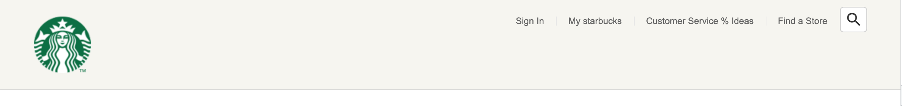
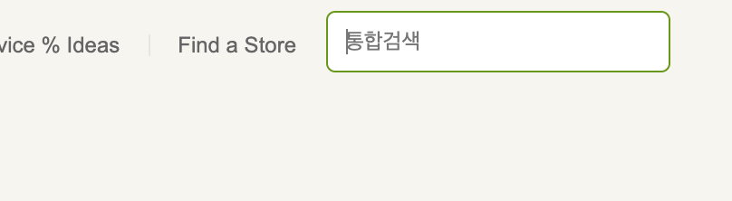

# 스타벅스 메인 페이지 클론 코딩

## FAVICON

대부분의 브라우저들은 프로젝트 root에 favicon.ico 파일이 있다면 자동으로 파비콘 이미지를 설정한다. (크롬은 아닌듯) 따로 지정하고싶다면 \<head>태그 안에서 아래와 같이 설정 가능하다.

`<link rel="icon" href="./favicon.png">`

## 오픈 그래프 (The Open Graph protocol)

웹 페이지가 소셜 미디어로 공유될 때 우선적으로 활용되는 정보를 지정한다.

~~~html
<meta property="og:type" content="website" />
<meta property="og:site_name" content="Starbucks" />
<meta property="og:title" content="Starbucks Coffee Korea" />
<meta property="og:description" content="스타벅스는 세계에서 가장 큰 다국적 커피 전문점으로, 64개국에서 총 23,187개의 매점을 운영하고 있습니다." />
<meta property="og:image" content="./images/starbucks_seo.jpg" />
<meta property="og:url" content="https://starbucks.co.kr" />
~~~

- `og:type`: 페이지의 유형(E.g, `website`, `video.movie`)
- `og:site_name`: 속한 사이트의 이름
- `og:title`: 페이지의 이름(제목)
- `og:description`: 페이지의 간단한 설명
- `og:image`: 페이지의 대표 이미지 주소(URL)
- `og:url`: 페이지 주소(URL)

## 트위터 카드

~~~python
<meta property="twitter:card" content="summary" />
<meta property="twitter:site" content="Starbucks" />
<meta property="twitter:title" content="Starbucks Coffee Korea" />
<meta property="twitter:description" content="스타벅스는 세계에서 가장 큰 다국적 커피 전문점으로, 64개국에서 총 23,187개의 매점을 운영하고 있습니다." />
<meta property="twitter:image" content="./images/starbucks_seo.jpg" />
<meta property="twitter:url" content="https://starbucks.co.kr" />
~~~

- `twitter:card`: 페이지(카드)의 유형(E.g. `summary`, `player`)
- `twitter:site`: 속한 사이트의 이름
- `twitter:title`: 페이지의 이름(제목)
- `twitter:description`: 페이지의 간단한 설명
- `twitter:image`: 페이지의 대표 이미지 주소(URL)
- `twitter:url`: 페이지 주소(URL)

### 로컬호스트 환경에서 트위터카드 테스트 하는 법

> https://codingjames.ca/how-to-test-twitter-cards-from-localhost/

Ngrok을 이용하여  **secure tunnels**를 생성. 인터넷과 로컬호스트를 쉽게 연결하고 트위터카드를 테스트할 수 있음. 

## 구글 폰트 (Google Fonts)

Google에 Google Fonts 검색하고 들어가면 폰트들 미리보기와 함께 Select this style 버튼을 통해서 html 문서에 폰트를 링크로 연결할 수 있음.

폰트의 용량이 크기때문에, 너무 남발하지 않는 것이 중요함. 꼭 필요한 폰트와 두께만 가져와서 연결할 것.

## Google Materials designs

구글에서 제공하는 디자인 자료 사이트.

https://fonts.google.com/icons

픽토그램, 아이콘 사이트.
기본적으로 아이콘들은 폰트로 취급되며 기본 사이즈는 24px

## HEADER

헤더 영역 안에 로고, 메뉴등 요소들을 가운데 정렬하는 inner를 만드는 방식이 많이 쓰인다. 

~~~ css
header {
	background-color: royalblue;
}

header .inner {
	width: 1100px;
	margin: 0 auto;
	background-color: orange;
}  

~~~

색상은 영역 확인 위해서 넣어놓은 것

### img 태그를 감싸는 부분에 남는 공간이 생기는 이유

 Img태그는 인라인요소이며 인라인 요소는 글자 취급되어 베이스 라인이 생긴다. 따라서 이미지 태그 아래쪽에 생기는 특정한 공간은 베이스라인이다.

css 파일에서 img 태그선택자를 이용해서 display를 블럭 요소로 바꿔주면 문제 해결.

### 수직 가운데 배치 방법 (배치 != 정렬)

position은 absolute로 하고 top, bottom 속성의 값을 0으로 입력한다.
높이값이 명시되어있는 상태에서 margin속성의 값을 auto 0으로 입력하면 성공!

수평 가운데 정렬은 마찬가지로 left, right 속성의 값을 0으로 입력하고 가로 너비가 명시되어있는 상태에서  margin에 0 auto를 입력하면 된다. 

수직, 수평 가운데정렬 즉 정 가운데 정력을 위해서는 top, bottom, left, right 전부 0으로 입력하고 margin에 auto를 입력하면 된다.

### a 태그에 연결할 페이지가 아직 완성되지 않았을 때

href 속성의 값에 javascript:void(0) 넣어주기

### CSS 선택자 TIP

상위 선택자를 명시해주지 않으면 내가 원하지 않는 부분에 영향을 줄 수 있기 때문에 항상 상위 선택자까지 같이 명시할 것. 추후 CSCC 이용하면 계속 중복되는 상위 선택자에 대한 문제 해결이 가능해짐  (아래참고)

~~~ CSS
header .sub-menu {

}
header .sub-menu ul.menu {

}
header .sub-menu ul.menu li {

}
header .sub-menu ul.menu li a{

}
~~~

### 오른쪽 상단의 서브메뉴 만들기

#### 완성 예시

* 아무런 동작을 하지 않았을 때

	

* 돋보기 아이콘에 포커스 되었을 때
	

#### HTML 구조

~~~html
<header>
  

    

    

      <ul class="menu">
        <li>
          <a href="./signin">Sign In</a>
        </li>
        <li>
          <a href="javascript:void(0)">My starbucks</a>
        </li>
        <li>
          <a href="javascript:void(0)">Customer Service % Ideas</a>
        </li>
        <li>
          <a href="javascript:void(0)">Find a Store</a>
        </li>
      </ul>
      

        <input type="text" />
        
search

      

    

  

</header>
~~~

* \<header>의 자식 \

*  \
의 자식인 \

* \
의 자식인 \

