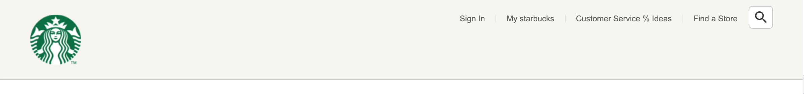
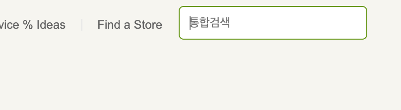

# 학습 내용 정리

## FAVICON

대부분의 브라우저들은 프로젝트 root에 favicon.ico 파일이 있다면 자동으로 파비콘 이미지를 설정한다. (크롬은 아닌듯) 따로 지정하고싶다면 \<head>태그 안에서 아래와 같이 설정 가능하다.

`<link rel="icon" href="./favicon.png">`

## 오픈 그래프 (The Open Graph protocol)

웹 페이지가 소셜 미디어로 공유될 때 우선적으로 활용되는 정보를 지정한다.

~~~html
<meta property="og:type" content="website" />
<meta property="og:site_name" content="Starbucks" />
<meta property="og:title" content="Starbucks Coffee Korea" />
<meta property="og:description" content="스타벅스는 세계에서 가장 큰 다국적 커피 전문점으로, 64개국에서 총 23,187개의 매점을 운영하고 있습니다." />
<meta property="og:image" content="./images/starbucks_seo.jpg" />
<meta property="og:url" content="https://starbucks.co.kr" />
~~~

- `og:type`: 페이지의 유형(E.g, `website`, `video.movie`)
- `og:site_name`: 속한 사이트의 이름
- `og:title`: 페이지의 이름(제목)
- `og:description`: 페이지의 간단한 설명
- `og:image`: 페이지의 대표 이미지 주소(URL)
- `og:url`: 페이지 주소(URL)

## 트위터 카드

~~~python
<meta property="twitter:card" content="summary" />
<meta property="twitter:site" content="Starbucks" />
<meta property="twitter:title" content="Starbucks Coffee Korea" />
<meta property="twitter:description" content="스타벅스는 세계에서 가장 큰 다국적 커피 전문점으로, 64개국에서 총 23,187개의 매점을 운영하고 있습니다." />
<meta property="twitter:image" content="./images/starbucks_seo.jpg" />
<meta property="twitter:url" content="https://starbucks.co.kr" />
~~~

- `twitter:card`: 페이지(카드)의 유형(E.g. `summary`, `player`)
- `twitter:site`: 속한 사이트의 이름
- `twitter:title`: 페이지의 이름(제목)
- `twitter:description`: 페이지의 간단한 설명
- `twitter:image`: 페이지의 대표 이미지 주소(URL)
- `twitter:url`: 페이지 주소(URL)

### 로컬호스트 환경에서 트위터카드 테스트 하는 법

> https://codingjames.ca/how-to-test-twitter-cards-from-localhost/

Ngrok을 이용하여  **secure tunnels**를 생성. 인터넷과 로컬호스트를 쉽게 연결하고 트위터카드를 테스트할 수 있음. 

## 구글 폰트 (Google Fonts)

Google에 Google Fonts 검색하고 들어가면 폰트들 미리보기와 함께 Select this style 버튼을 통해서 html 문서에 폰트를 링크로 연결할 수 있음.

폰트의 용량이 크기때문에, 너무 남발하지 않는 것이 중요함. 꼭 필요한 폰트와 두께만 가져와서 연결할 것.

## Google Materials designs

구글에서 제공하는 디자인 자료 사이트.

https://fonts.google.com/icons

픽토그램, 아이콘 사이트.
기본적으로 아이콘들은 폰트로 취급되며 기본 사이즈는 24px

## BEM (Block Element Modifier)

HTML 클래스 속성의 작명법

* 요소__일부분 : 요소의 일부분을 표시
* 요소 --상태 : 요소의 상태를 표시 

~~~css

	

	

		

	

~~~

## HEADER

헤더 영역 안에 로고, 메뉴등 요소들을 가운데 정렬하는 inner를 만드는 방식이 많이 쓰인다. 

~~~ css
header {
	background-color: royalblue;
}

header .inner {
	width: 1100px;
	margin: 0 auto;
	background-color: orange;
}  

~~~

색상은 영역 확인 위해서 넣어놓은 것

### img 태그를 감싸는 부분에 남는 공간이 생기는 이유

 Img태그는 인라인요소이며 인라인 요소는 글자 취급되어 베이스 라인이 생긴다. 따라서 이미지 태그 아래쪽에 생기는 특정한 공간은 베이스라인이다.

css 파일에서 img 태그선택자를 이용해서 display를 블럭 요소로 바꿔주면 문제 해결.

### 수직 가운데 배치 방법 (배치 != 정렬)

position은 absolute로 하고 top, bottom 속성의 값을 0으로 입력한다.
**높이값이 명시되어있는 상태**에서 margin속성의 값을 auto 0으로 입력하면 성공!

수평 가운데 정렬은 마찬가지로 left, right 속성의 값을 0으로 입력하고 가로 너비가 명시되어있는 상태에서  margin에 0 auto를 입력하면 된다. 

수직, 수평 가운데정렬 즉 정 가운데 정력을 위해서는 top, bottom, left, right 전부 0으로 입력하고 margin에 auto를 입력하면 된다.

### a 태그에 연결할 페이지가 아직 완성되지 않았을 때

href 속성의 값에 javascript:void(0) 넣어주기

### CSS 선택자 TIP

상위 선택자를 명시해주지 않으면 내가 원하지 않는 부분에 영향을 줄 수 있기 때문에 항상 상위 선택자까지 같이 명시할 것. 추후 CSCC 이용하면 계속 중복되는 상위 선택자에 대한 문제 해결이 가능해짐  (아래참고)

~~~ CSS
header .sub-menu {

}
header .sub-menu ul.menu {

}
header .sub-menu ul.menu li {

}
header .sub-menu ul.menu li a{

}
~~~

### 오른쪽 상단의 서브메뉴 만들기

#### 완성 예시

* 아무런 동작을 하지 않았을 때

	

* 돋보기 아이콘에 포커스 되었을 때
	

#### HTML 구조

~~~html
<header>
  

    

    

      <ul class="menu">
        <li>
          <a href="./signin">Sign In</a>
        </li>
        <li>
          <a href="javascript:void(0)">My starbucks</a>
        </li>
        <li>
          <a href="javascript:void(0)">Customer Service % Ideas</a>
        </li>
        <li>
          <a href="javascript:void(0)">Find a Store</a>
        </li>
      </ul>
      

        <input type="text" />
        
search

      

    

  

</header>
~~~

* \<header>의 자식 \

*  \
의 자식인 \

* \
의 자식인 \

* javascript:void(0) 은 아무런 동작을 하지 않는 것을 표현
* Ul 태그이자 menu 클래스의 형제인 search 클래스 
* Search 클래스 태그 안에 인풋태그와 검색 아이콘을 위한 div 태그

#### CSS 구조

~~~css
/* HEADER */
header {
	background-color: #f6f5f0;
	border-bottom: 1px solid #c8c8c8;
}
header .inner {
	position: relative;
	width: 1100px;
	height: 120px;
	margin: 0 auto; // 좌우 정렬 
}
header .logo {
	position: absolute; // 부모(relative) 기준으로 배치
	height: 75px;
	top: 0;
	left: 0;
	bottom: 0;
	margin: auto 0; // 세로 정렬
}
header .sub-menu {
	position: absolute;
	top: 10px;
	right: 0;
	display: flex; // 원래 블럭요소라 아래로 쌓이던 것을 일렬로 세움 
									//<ul class="menu">와 

}
header .sub-menu ul.menu { 
	font-family: Arial, sans-serif; 
	display: flex; // <ul class="menu"> 아래의 li태그들이 일렬로 세워짐
}
header .sub-menu ul.menu li {
	position: relative;
}
header .sub-menu ul.menu li::before { // 가상 요소 선택자 (인라인 요소)
**** 가상요소 선택자는 인라인 요소로 생성되기 때문에 세로, 너비 값을 줄 수 없는데 해당 경우에선 원하는 사이즈의 세로줄을 넣어야 하기 때문에 세로, 너비 값이 필요함. 따라서 블록 요소로 바꿔주어야함. 그런데 position을 absolute로 설정하는 경우 자동으로 블록 요소가 됨.****
	content: ""; //필수 요소
	width: 1px;
	height: 12px;
	background-color: #e5e5e5;
	position: absolute; // li 태그가 부모 요소임. 
	top: 0;
	bottom: 0;
	margin: auto 0; // 수직 저
}
header .sub-menu ul.menu li:first-child:before { // 맨 앞의 |는 없애기
	display: none;
}
header .sub-menu ul.menu li a{ // a 태그는 인라인 요소임
	font-size: 12px;
	padding: 11px 16px;
	display: block;
	color: #656565;
}
header .sub-menu ul.menu li a:hover{
	font-size: 12px;
	padding: 11px 16px;
	display: block;
	color: #000;
}
header .sub-menu .search {
	height: 34px;
	position: relative;
}
header .sub-menu .search input{
	width: 36px;
	height: 34px;
	padding: 4px 10px;
	border: 1px solid #ccc;
	box-sizing: border-box;
	border-radius: 5px;
	outline: none; // input 태그가 포커스 되었을 때 겉에 파란색 (또는 브라우저 지정색) 외부 선이 생기는 것을 없앰
	background-color: #fff;
	color: #777;
	font-size: 12px;
	transition: width .4s;
}
header .sub-menu .search input:focus{
	width: 190px;
	border-color: #669900;
}
header .sub-menu .search .material-icons{
	height: 24px;
	position: absolute // search 클래스를 가진 태그가 부모임
	top: 0;
	bottom: 0;
	right: 5px; // search 클래스를 가진 태그의 오른쪽으로부터 5 px떨어진 곳
	margin: auto;
	transition: .4s; // 변화가 생기면 0.4초의 전환효과를 줌
}
header .sub-menu .search.focused .material-icons{
	opacity: 0; // 자바스크립트 파일에 의해 search 클래스를 가진 태그에 focused 클래스가 추가되었을 경우 검색 아이콘을 지우기 위한 속성
}
~~~

#### 자바스크립트 구조

~~~javascript
const searchEl = document.querySelector('.search');
const searchInputEl = searchEl.querySelector('input');

searchEl.addEventListener('click', function () { 
// 원래 검색 아이콘을 누르면 포커스 되지 않는데 search 태그 영역을 클릭하면 포커스 되도록 하는 것
	searchInputEl.focus();
});

searchInputEl.addEventListener('focus', function () {
	searchEl.classList.add('focused'); 
	// CSS 파일에서 .search.focused 인 부분에서 검색 아이콘을 잠시 없애기 위해 필요한 부분
	searchInputEl.setAttribute('placeholder', '통합검색');
  // input 태크가 포커스 되었을 때 placeholder 속성에 "통합검색"을 값으로 지정
});

searchInputEl.addEventListener('blur', function () {
	searchEl.classList.remove('focused');
	searchInputEl.setAttribute('placeholder', '');
  // 포커스가 끝났을 때 위에서 설정한 것들을 삭제하는 부분
});
~~~

### 메인메뉴 만들기

#### position: absolute & fixed

블록요소는 가로 너비가 부모의 크기만큼 최대한 늘어나는 성질이 있지만 position 값이 absolute나  fixed이면 최소한으로 줄어드는 성질이 있다. 

#### 메인메뉴에 마우스를 올렸을 때 나오는 내용만들기

* 왜 부모요소에 크기를 지정하지 않았는데 자식 요소들을 다 감싸지 않는가?? 
  div태그는 부모요소에 크기를 지정하지 않으면 높이는 자식요소 만큼, 너비는 자신의 부모 요소만큼을 갖게 된다.
  그런데 분명 부모요소에 크기를 지정하지 않았음에도 자식요소를 다 감싸지 않아서 어떤 것이 문제인지 계속 찾아보았고, 이전에 작성한 조상태그에 하위 선택자를 이용하여 높이 값을 지정해놓은 부분을 찾았다.
  **부모요소가 자식요소를 감싸지 않는 문제를 확인했을 때에는 조상요소에서 크기를 지정한 부분이 있지는 않은지 확인하기!!**

#### lodash cdn

자바스크립트 라이브러리. 스크롤 이벤트 함수를 처리할 때 많이 사용함. 함수 실행에 부하를 주어서 함수 실행을 제어하는 함수 제공. 

~~~js
window.addEventListener('scroll', _.throttle(function(){ // 0.3초 단위로 부하를 주어서 함수가 실행되는 것을 제어
	console.log('scroll!');
}, 300)); 
~~~

#### gsap cdn

자바스크립트에서 애니메이션 효과를 줄 수 있도록 함수들을 제공하는 라이브러리.

* ​    gsap.to(처리할 요소, 지속시간, 어떻게 처리할 지 옵션);

~~~js
if (window.scrollY > 500) {
		gsap.to(badgeEl, .6, {
			opacity: 0,
			display: 'none'
		});
	} else {
		gsap.to(badgeEl, .6, {
			opacity: 1,
			display: 'block'
		});
	}
~~~

## VISUAL 

* SECTION 태그 : *HTML* 문서의 독립적인 일반 구획 요소 

#### 구조상의 부모

Position: absolute를 이용해서 부모요소를 기준으로 배치하는 부분에서, 무조건 부모 요소는 position: relative여야 하는 것이 아니라! 부모요소가 position 값을 가지고 있으면 된다. fixed, relative, absolute 등

#### 여러개 요소 각각 페이드인 하기

forEach 함수와 gsap을 이용해서 각각 요소에 딜레이 시간을 주어서 구현.

~~~js
const fadeEls = document.querySelectorAll('.visual .fade-in');
fadeEls.forEach(function (fadeEl, index) {
	gsap.to(fadeEl, 1, {
		delay: (index + 1) * .7, // 0.7 1.4 2.1 2.7 순으로 딜레이 생김
		// 만약 그냥 delay를 .7으로 두면 모든 이미지가 0.7초 후에 한번에 나타남 모든 요소에 .7초 후에 나타나라고 명령했기 때문
		opacity: 1
	})
});
~~~

## NOTICE

### % 크기

width나 height에 %를 이용해서 크기를 지정했을 때 어떤 것을 기준으로 %를 계산할까?

부모에 높이, 너비 값이 지정되어있다면 그 값을 따라갈 것이다.
만약 부모가 높이와 너비 값을 가지고 있지 않을 때, 형제 요소중 높이, 너비 값을 가지고 있는 형제가 있다면 그 형제의 크기에 따라서 부모의 크기가 결정된다. 그 크기를 기준으로 % 크기 계산이 이루어진다. 

### swiperjs

슬라이드를 구현할 수 있게 하는 자바스크립트 라이브러리  https://swiperjs.com

Demos에 들어가서 원하는 슬라이드 동작을 선택하고 Core를 누르면 코드를 볼 수 있음.

Get started 부분 참고해서 css, js 파일과 html을 연결하고 기본 구조를 html 문서에 작성한 후에 js 코드를 추가.

~~~js
// new Swiper(선택자, 옵션)
new Swiper('.notice-line .swiper-container', {
	direction: 'vertical',
	autoplay: true,
	loop: true
});
~~~

### 버튼을 통해 요소가 나오고 사라지게 만들기

css만 가지고 구현하기에 한계가 있는 것은 gsap을 이용하지만, 버튼을 통해서 단순히 나오고 사라지게 하는 정도는 css를 통해서 제어 가능하다.

~~~js
const promotionEl = document.querySelector('.promotion');
const promotionToggleBtn = document.querySelector('.toggle-promotion');
let isHidePromotion = false;

promotionToggleBtn.addEventListener('click', function () {
	isHidePromotion = !isHidePromotion;
	// 변수의 값을 지속적으로 반대 값으로 전환시켜줄 수 있음
	if (isHidePromotion) {
		// 숨김 처리
		promotionEl.classList.add('hide');
	} else {
		// 보임 처리
		promotionEl.classList.remove('hide');
	}
})
~~~

## YOUTUBE

### 가로, 세로 비율이 있는 요소 만들기

부모에 너비 값만 존재하고 높이 값이 없는 상태에서 자식 요소의 너비를 100%로 하고 높이를 0으로 주고, padding-top을 50%로 입력했을 때, 세로가 가로의 50% 크기만큼 부여된다. 

Padding 값은 요소의 width를 참고하기 때문이다. 

padding-top을 56.25%로 하면 16:9 비율이 되며 이는 동영상 컨텐츠를 가져올 때 흔히 사용된다. 

### youtube iframe api

유튜브 영상을 재생할 영역은 \
\
 작성

자바스크립트 파일 생성

~~~js
// Youtube IFrame API를 비동기로 로드합니다.
var tag = document.createElement('script');
tag.src = "https://www.youtube.com/iframe_api";
var firstScriptTag = document.getElementsByTagName('script')[0];
firstScriptTag.parentNode.insertBefore(tag, firstScriptTag);

function onYouTubePlayerAPIReady() {
  // 

  new YT.Player('player', {
    videoId: 'An6LvWQuj_8', // 재생할 유튜브 영상 ID
    playerVars: {
      autoplay: true, // 자동 재생 유무
      loop: true, // 반복 재생 유무
      playlist: 'An6LvWQuj_8' // 반복 재생할 유튜브 영상 ID 목록
    },
    events: {
      // 영상이 준비되었을 때,
      onReady: function (event) {
        event.target.mute(); // 음소거!
      }
    }
  });
}
~~~

 ### gsap easing

gsap으로 애니메이션 효과를 줄 때 효과의 빠르기? 를 조절 가능

type: easeInOut 은 완만한 느낌.

### random 함수

~~~js
// 범위 랜덤 함수(소수점 2자리까지)
function random(min, max) {
	// `.toFixed()`를 통해 반환된 문자 데이터를,
  // `parseFloat()`을 통해 소수점을 가지는 숫자 데이터로 변환
  return parseFloat((Math.random() * (max - min) + min).toFixed(2))
}
~~~

* parseFloat ?

* toFixed ?

## RESERVE-STORE

### 마우스를 올리면 카드가 뒤집어지는 애니메이션

Backface-visibility 속성을 이용해서 요소가 180도 뒤집어져서 뒷면이 보일때 그 뒷면을 보이지 않게 하여 카드가 뒤집어지는 애니메이션을 만들 수 있다.

~~~css
.reserve-store .medal {
	width: 334px;
	height: 334px;
	perspective: 300px;
}
.reserve-store .medal .front,
.reserve-store .medal .back {
	position: absolute;
	width: 334px;
	height: 334px;
	backface-visibility: hidden;
	/* 뒷면은 보여주지 않음 */
	transition: 1s;
}
.reserve-store .medal .front {
	transform: rotateY(0deg);
}
.reserve-store .medal .back {
	transform: rotateY(-180deg);
}
.reserve-store .medal:hover .front {
	transform: rotateY(-180deg);
}
.reserve-store .medal:hover .back {
	transform: rotateY(0deg);
}
~~~

## 스크롤 애니메이션

화면을 스크롤할 때, 각각의 섹션들이 화면에 보이게 되면 애니메이션 처리를 하여 이미지 요소들이 나오게 하기.

### ScrollMagic cdn

원하는 섹션이 화면에 보이고 있는지 그렇지 않은지 판단할 수 있게 하는 자바스크립트 라이브러리

~~~js
const spyEls = document.querySelectorAll('section.scroll-spy');
spyEls.forEach(function (spyEl) {
	new ScrollMagic
		.Scene({
			triggerElement: spyEl // 보여짐 여부를 감시할 요소를 지정
			triggerHook: 0.8 // 뷰포트 0.8 지점을 넘어가면 실행
		})
		.setClassToggle(spyEl, 'show')
		.addTo(new ScrollMagic.Controller());
});
~~~

section.scroll-spy 선택자에 해당하는 요소가 뷰포트 0.8 지점을 지나가면 해당 요소에 show라는 클래스를 추가하고 만약 다시 0.8 지점을 지나지 않게 되면 show라는 클래스를 삭제함. 

애니메이션을 적용할 section에 scroll-spy클래스를 추가하고 애니메이션이 적용될 각각의 요소에 클래스를 추가해서 css에서 애니메이션 처리를 해준다. 

~~~css
.back-to-position {
	opacity: 0;
	transition: 1s;
}
.back-to-position.to-right {
	transform: translateX(-150px);
}
.back-to-position.to-left {
	transform: translateX(150px);
}
.show .back-to-position {
	opacity: 1;
	transform: translateX(0);
}
.show .back-to-position.delay-0 {
	transition-delay: 0s;
}
.show .back-to-position.delay-1 {
	transition-delay: .3s;
}
.show .back-to-position.delay-2 {
	transition-delay: .6s;
}
.show .back-to-position.delay-3 {
	transition-delay: .9s;
}
~~~

.back-to-position 클래스를 가지고 있으면 투명도를 0으로 설정하고 전환효과를 1초로 설정한다. 

to-right 클래스를 가지고있으면 왼쪽에서 오른쪽으로 애니메이션이 되게 할 것이기 때문에 요소를 왼쪽으로 이동 시켜 놓아야 한다. to-left도 마찬가지로 요소를 오른쪽으로 이동 시켜 놓아야 한다.

요소가 ScrollMagic의 메소드를 통해서 설정한 뷰포트를 지나 show 클래스가 추가된다면 투명도를 1로 설정하고, 원래 우리가 설정해둔 자리로 돌아오게 한다. 

각각의 요소가 같이 움직이지 않고 딜레이를 주어서 따로따로 움직일 수 있게 한다. 

### 뷰포트 값

0이 최 상단, 1이 최 하단, 0.5가 가운데

## FOOTER

### 특수문자

Html 특수 기호를 뜻하는 html entities 검색
Dev.w3.org 페이지 참고 

